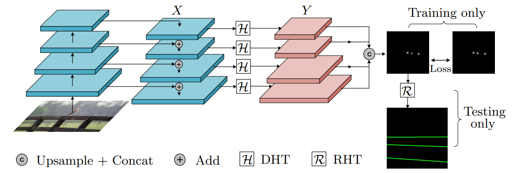

<h1 style="align: center; color: #159957">Deep Hough Transform for Semantic Line Detection</h1>

Jittor and Pytorch code accompanying the paper "Deep Hough Transform for Semantic Line Detection" (ECCV 2020, PAMI 2021).
[arXiv2003.04676](https://arxiv.org/abs/2003.04676) | [Online Demo](http://mc.nankai.edu.cn/dht) | [Project page](http://mmcheng.net/dhtline) | [New dataset](https://data.kaizhao.net/deep-hough-transform/NKL.zip) | [Line Annotator](https://github.com/Hanqer/lines-manual-labeling)


### Updates
* Thanks [@HassanBinHaroon](https://github.com/HassanBinHaroon) for the Google Colab implementation of our paper: <https://github.com/HassanBinHaroon/deep-hough-transform>. You can run it anywhere with Google colab.
* Training code is open available now.
* Jittor inference code is open available now.


### Deep Hough Transform


### Requirements
``` 
numpy
scipy
opencv-python
scikit-image
pytorch>=1.0
torchvision
tqdm
yml
POT
deep-hough
```

To install deep-hough, run the following commands.

```sh
cd deep-hough-transform
cd model/_cdht
python setup.py build 
python setup.py install --user
```
Pretrain models (based on ResNet50-FPN): <https://data.kaizhao.net/deep-hough-transform/dht_r50_fpn_sel-c9a29d40.pth> (SEL dataset) and 
<https://data.kaizhao.net/deep-hough-transform/dht_r50_nkl_d97b97138.pth> (NKL dataset / used in online demo)

### Prepare training data
Download original SEL dataset from [here](https://mcl.korea.ac.kr/research/Submitted/jtlee_slnet/ICCV2017_JTLEE_dataset.7z) and extract to `data/` directory. After that, the directory structure should be like:
```
data
├── ICCV2017_JTLEE_gtlines_all
├── ICCV2017_JTLEE_gt_pri_lines_for_test
├── ICCV2017_JTLEE_images
├── prepare_data_JTLEE.py
├── Readme.txt
├── test_idx_1716.txt
└── train_idx_1716.txt
```

Then run python script to generate parametric space label.
```sh
cd deep-hough-transform
python data/prepare_data_JTLEE.py --root './data/ICCV2017_JTLEE_images/' --label './data/ICCV2017_JTLEE_gtlines_all' --save-dir './data/training/JTLEE_resize_100_100/' --list './data/training/JTLEE.lst' --prefix 'JTLEE_resize_100_100' --fixsize 400 --numangle 100 --numrho 100
```
For NKL dataset, you can download the dataset and put it to data dir. Then run python script to generate parametric space label.
```sh
cd deep-hough-transform
python data/prepare_data_NKL.py --root './data/NKL' --label './data/NKL' --save-dir './data/training/NKL_resize_100_100' --fixsize 400
```

### Training
Following the default config file 'config.yml', you can arbitrarily modify hyperparameters.
Then, run the following command.
```sh
python train.py
```

### Testing
Please refer to [test](./test.md) for detailed steps to reproduce the testing results.

### Citation
If our method/dataset are useful to your research, please consider to cite us:
```
@article{zhao2021deep,
  author    = {Kai Zhao and Qi Han and Chang-bin Zhang and Jun Xu and Ming-ming Cheng},
  title     = {Deep Hough Transform for Semantic Line Detection},
  journal   = {IEEE Transactions on Pattern Analysis and Machine Intelligence (TPAMI)},
  year      = {2021},
  doi       = {10.1109/TPAMI.2021.3077129}
}
```
```
@inproceedings{eccv2020line,
  title={Deep Hough Transform for Semantic Line Detection},
  author={Qi Han and Kai Zhao and Jun Xu and Ming-Ming Cheng},
  booktitle={ECCV},
  pages={750--766},
  year={2020}
}
```

### License
This project is licensed under the [Creative Commons NonCommercial (CC BY-NC 3.0)](https://creativecommons.org/licenses/by-nc/3.0/) license where only
non-commercial usage is allowed. For commercial usage, please contact us.

